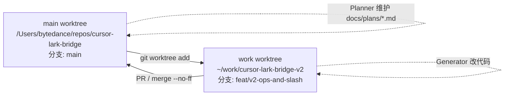

# cursor-lark-bridge V2 运维硬化 + 状态可见 实施方案

> **For Claude:** 本 Plan 由 Planner 负责维护。Generator 任务请用 `Task` 工具 `subagent_type=generalPurpose`，Evaluator 用 `subagent_type=generalPurpose, readonly=true`。每完成一个 task 必须更新进度文件 `docs/plans/2026-04-18-v2-status.md`。

**目标**：不动现有 Hook 模型的前提下，为 cursor-lark-bridge 补上"开机自启 + 崩溃恢复 + 日志轮转 + 斜杠命令状态可见"四大运维缺失，让 daemon 真正达到"正经 macOS 服务"水准，对应 v0.2.0 发布。

**架构约束**：保留 `Cursor Hook → curl --max-time 600 → daemon HTTP API (127.0.0.1:19836)` 的同步阻塞契约不变。daemon 侧新增 launchd 托管、按天滚动日志、指数退避重连、pending 内存 snapshot；`bridge.sh` 扩展 `service install/uninstall/logs` 子命令。

**技术栈**：Go 1.21（daemon，零第三方依赖）+ bash（bridge.sh）+ launchd plist + `lark-cli` 子进程（沿用 v1）。

---

## 1. 设计文档可行性评估（结论先行）

### 1.1 关键发现：设计文档 v2 的前提和真实 v1 不一致

| 维度 | 设计文档 4.1 节说的"v1" | 仓库里真实的 v1 |
|---|---|---|
| 交互载体 | Cursor Skill（`~/.cursor/skills/feishu-cursor-bridge/`） | Cursor Hook（`~/.cursor/hooks/cursor-lark-bridge/` 的 5 个 .sh/.py） |
| 消息读取 | Agent 读 `inbox.jsonl` | Hook 通过 `curl POST /approve` 阻塞等待 daemon 返回 `{decision}` |
| 消息发送 | Agent 调 Lark MCP | Daemon 直接 `exec lark-cli im +messages-send` |
| Pending 状态 | 文件 SSOT (`pending.json`) | Daemon 进程内 `map[string]*pendingEntry` |
| Skill 存在 | 假设已有 | `Glob **/SKILL.md` 结果为 0 files found |

**结论：设计文档的 P1（流式进度）和 P2 的 Unix Socket/pending.json 部分，前提是一套不存在的 Skill 架构**。直接按设计文档实施，等于悄悄做架构迁移，不是"三期增量"。

### 1.2 四维评估

- **必要性**：Phase 0 (运维硬化) 必要；Phase 1 (流式进度) 对 Hook 同步模型不适用；Phase 2 核心价值在"状态可见 + 批量停止"
- **向前兼容**：按路线 A（用户已选），Hook 契约完全不变，现有 6 类场景零改动
- **复杂度**：设计文档全量 ~30+ task 需新 Skill 体系；本 Plan 收敛后约 13 task 全在现有代码内
- **ROI**：补齐"开机自启/崩溃恢复/日志可查/状态可见"这 4 个 v1 最痛缺失，用户感知最强

### 1.3 明确砍掉
- Skill 体系（SKILL.md / ~/.cursor/skills/feishu-cursor-bridge/）
- `inbox.jsonl` 文件异步模型
- `streaming.json` + `message_update` 流式进度（整个 Phase 1）
- `context_note` 自动化（`hooks/agent-label.py` 已覆盖 workspace 区分）
- 卡片头部 `[workspace]` 标记（同上，底部 note 已有 Agent 标识）
- Unix Socket + `pending.json` 持久化（改为 daemon 内存 snapshot）

### 1.4 明确保留并适配
- Phase 0 全部：launchd plist、按天滚动日志、supervisor 指数退避、`daemon.pid` 扩展
- Phase 2 核心：`/status /stop /ping /help` 斜杠命令 + 中文别名 `/状态 /停止 /帮助 /指令`
- Phase 2 适配：`/stop` 语义改为"向内存 pending map 的每个 chan 写 deny"（而非写文件）

---

## 2. 多 Agent 协作机制

### 2.1 角色分工

- **Planner**（主会话的我）
  - 维护 [docs/plans/2026-04-18-v2-ops-and-slash.md](docs/plans/2026-04-18-v2-ops-and-slash.md)（本文件的正式副本）和 [docs/plans/2026-04-18-v2-status.md](docs/plans/2026-04-18-v2-status.md) 进度文件
  - 每个 checkpoint 与用户交互确认
  - 根据 Evaluator 反馈决定 task 是否 pass / rework
  - 最终 merge 决策

- **Generator**（通过 `Task` 工具，`subagent_type=generalPurpose`，**非 readonly**）
  - 在隔离 git worktree 内按 task 实施
  - 遵循 TDD：先写/改测试，再动代码
  - 每完成一个 task 提交一次 git commit
  - 回报：`diff summary` + `self-check checklist` + `下一步建议`

- **Evaluator**（通过 `Task` 工具，`subagent_type=generalPurpose`，`readonly=true`）
  - 只读模式，不改任何文件
  - 两阶段审：(a) spec 合规性 — 对齐 task 定义；(b) 代码质量 — DRY / 命名 / 错误处理 / 复杂度
  - 回报：`verdict: pass|rework` + `具体问题清单`（带文件路径行号）

### 2.2 Worktree 约定



- 主 worktree 只存 `docs/plans/*.md`（方便用户 review 时不受代码改动干扰）
- 所有 daemon / bridge.sh / hook / plist 变更都在工作 worktree
- 工作 worktree 的提交 rebase 上最新 main 后再 merge

### 2.3 进度追踪文件 schema

`docs/plans/2026-04-18-v2-status.md`（规则化文本）：

```
# V2 执行进度（Planner 维护，每次 Generator/Evaluator 回报后更新）

## Phase: SETUP | P0 | P2 | FINISH
## Active Task: <task_id>
## Updated At: <ISO8601>

## Tasks
- [SETUP.0] worktree + 进度文件           | done       | commit: <sha>
- [P0.1]    launchd plist 模板             | in_progress | generator: <agent_id>
- [P0.2]    daemon 按天滚动日志            | pending
- ...

## Last Evaluator Report (task P0.1)
verdict: pass
notes:
  - 符合 spec 第 X 条
  - 测试覆盖: 2/2 单测通过
  - ...
```

状态机：`pending → in_progress → done_pending_review → done | rework`

### 2.4 Checkpoint

| ID | 时机 | Planner 做什么 | 用户要确认什么 |
|---|---|---|---|
| CP1 | 现在 | 提交本 Plan 供批 | Plan scope、路线 A、13 个 task 拆分合理否 |
| CP2 | P0 启动前 | 展示 launchd plist 路径/日志格式/service 是否并入 bridge.sh 的决策 | 运维接入点和路径约定 |
| CP3 | P0 完成后 | 请用户跑一次 `fb service install` / `pkill -9` / `fb status` / `fb service logs` | e2e 运维能力达标 |
| CP4 | P2 启动前 | 展示斜杠命令文案和 `/status` 卡片样例 JSON | UX 细节 |
| CP5 | P2 完成后 | 请用户在真实飞书里发 `/status` / `/stop` / `/ping` / `/help` | 实战可用 |
| CP6 | merge 前 | 展示整体 diff + 版本号提议 (v0.2.0) | 是否合回 main + 打 tag |

---

## 3. 实施 Task 列表

### Task SETUP.0：worktree + 进度文件初始化

**文件**
- Create: `docs/plans/2026-04-18-v2-ops-and-slash.md`（把本 Plan 写入主 worktree，供 git 追踪）
- Create: `docs/plans/2026-04-18-v2-status.md`（进度追踪）
- 新 worktree: `~/work/cursor-lark-bridge-v2`，分支 `feat/v2-ops-and-slash`

**步骤**
1. 主 worktree 执行 `git worktree add -b feat/v2-ops-and-slash ~/work/cursor-lark-bridge-v2`
2. 主 worktree 新增 `docs/plans/*.md` 后 `git add -N` 并 commit on main
3. 进度文件初始化所有 task 为 `pending`，除 SETUP.0 为 `done`
4. 提交 commit: `docs(plans): add V2 ops+slash plan and status tracker`

**验收**
- `git worktree list` 展示两个 worktree
- 主 worktree `git log` 最新 commit 是 docs(plans)
- 进度文件通过 markdown lint

---

### Phase 0：运维硬化

#### Task P0.1：launchd plist 模板 + 安装脚本

**文件**
- Create: `launchd/com.cursor.feishu-bridge.plist.template`
- Modify: `scripts/bridge.sh`（新增 `cmd_service_install` 函数，复用已有 `BRIDGE_DIR`、`DAEMON_BIN`）
- Modify: `.goreleaser.yml`（`archives.files` 加 `launchd/*.plist.template`）

**关键决策（CP2 前确认）**
- plist `Label`: `com.cursor.feishu-bridge`
- 安装位置: `~/Library/LaunchAgents/com.cursor.feishu-bridge.plist`
- `RunAtLoad=true` + `KeepAlive.SuccessfulExit=false` + `KeepAlive.Crashed=true` + `ThrottleInterval=10`
- `StandardOutPath` / `StandardErrorPath` 指向 `~/.cursor/cursor-lark-bridge/logs/launchd-{stdout,stderr}.log`
- plist 里路径用 `__HOME__` 占位，install 时 `sed` 替换为实际 `$HOME`

**步骤**
1. 写 plist 模板（字段严格按设计文档 5.4）
2. `bridge.sh` 新增 `cmd_service_install`：检查旧 plist 存在→备份→`sed` 渲染路径→`launchctl unload`（忽略失败）→`cp` 到 `~/Library/LaunchAgents/`→`launchctl load`→打印状态
3. `cmd_service_uninstall`：`launchctl unload` + `rm plist`，保留 `~/.cursor/cursor-lark-bridge/` 数据目录
4. 更新 `bridge.sh` 顶部用法注释 + 底部 `case` 分发
5. 在 `tests/` 新增 `service-install-test.sh`：install → `launchctl list com.cursor.feishu-bridge` → uninstall → 确认 plist 不存在
6. commit: `feat(ops): add launchd plist + bridge.sh service subcommand`

**验收**
- `bash service-install-test.sh` 退出码 0
- `fb service install` 后 `launchctl list | grep feishu-bridge` 有结果
- 手动 `pkill -9 cursor-lark-bridge-daemon`，10 秒内 `fb status` 显示 daemon 恢复

---

#### Task P0.2：daemon 按天滚动日志

**文件**
- Modify: `daemon/main.go`（新增 `logs/dailyRotator.go` 功能，或集成进 `main.go`）

**关键设计**
- 新结构 `dailyLogger`，字段 `mu sync.Mutex`、`file *os.File`、`date string`（`YYYY-MM-DD`）
- `Write(p []byte)` 实现 `io.Writer`：锁 → 判日期差 → 差则 close old + open new → 写
- 启动时 `log.SetOutput(&dailyLogger{...})`，替换当前默认 stderr
- 日志目录 `~/.cursor/cursor-lark-bridge/logs/daemon-YYYY-MM-DD.log`
- 启动时扫描 `logs/daemon-*.log`，`mtime > 7*24h` 的删除
- `launchd-{stdout,stderr}.log` 由 launchd 自己写，daemon 不管

**步骤**
1. 写 `dailyLogger` 单测：伪造 `now()` 注入（接 `clock func() time.Time` 字段），跨天后验证切了新文件
2. 实现 `dailyLogger`，在 `main()` 里替换默认 `log.SetOutput`
3. 新增 `cleanupOldLogs(dir string, keepDays int)`，`main()` 启动时调用
4. 单测：放 8 个 mtime 不同的假日志，调用后 `mtime > 7 天` 的都被删
5. commit: `feat(daemon): per-day rolling log with 7-day retention`

**验收**
- `go test ./daemon/...` 所有单测通过
- 手动跑一整天后 `logs/daemon-*.log` 有两份
- 人工 `touch -t 202601010000 logs/daemon-2026-01-01.log` 后重启 daemon，文件被删

---

#### Task P0.3：daemon.pid 扩展为 JSON

**文件**
- Modify: `daemon/main.go`（`acquirePIDLock` / `removePID`）
- Modify: `scripts/bridge.sh`（`is_daemon_running` / `show_status` 读取 JSON）

**关键设计**
- `pid.json` 字段：`pid int`、`start_ts int64`（Unix 秒）、`version string`、`reconnect_count int64`
- 兼容读取：若文件内容不是 JSON（单行 PID），走 v1 fallback 解析，保证升级时不吃瘪
- `reconnect_count` 由 supervisor 在 backoff 时 `atomic.AddInt64` 后 re-marshal 写回
- 写入用 `write-to-tmp + rename` 原子替换

**步骤**
1. 先写 `daemon/pidfile_test.go`：写 JSON → 读回 → 校验字段；写兼容单行 PID → 读回 pid 正确，其它字段零值
2. 重构 `acquirePIDLock`：优先按 JSON 解析；失败才走 v1 单行 PID fallback
3. 新增 `updatePIDFile(update func(*PIDInfo))` 供 supervisor 调用
4. `bridge.sh` 的 `is_daemon_running` 加 JSON 路径支持：`python3 -c 'import json,sys;print(json.load(open("$PID_FILE"))["pid"])'`，fail 时回退 cat 单行
5. commit: `feat(daemon): extend daemon.pid to JSON with metadata`

**验收**
- 单测全过
- `fb status` 新版本能读新 JSON，保留 `Version: v0.x.y` 输出
- 保留仓库里的一个 `daemon.pid` 单行 PID 样例文件，升级后第一次启动不报错

---

#### Task P0.4：supervisor 指数退避重连

**文件**
- Modify: `daemon/main.go`（`runOneSubscription` / `startEventSubscription` 的 sleep 部分）

**关键设计**
- 当前固定 `sleepCtx(ctx, 3*time.Second)` 改为指数退避：`2s → 4s → 8s → … → 300s`（上限 5 分钟）
- 收到首条事件后重置 backoff 为 `initBackoff=2s`
- 每次 backoff 写 `daemon.pid` 的 `reconnect_count++`

**步骤**
1. 抽出 `type backoffState struct { cur time.Duration }` + `Next()` / `Reset()` 方法
2. 单测 `TestBackoffNext`：初始 2s，连续 10 次后封顶 300s
3. 在 `runEvents` 收到首行 event 时 `backoff.Reset()`
4. 在 supervisor 循环里用 `backoff.Next()` 替换固定 3s
5. 每次 `Next()` 调用 `updatePIDFile` 让 `reconnect_count++`
6. commit: `feat(daemon): exponential backoff supervisor + reconnect metrics`

**验收**
- 单测 `TestBackoffNext` 通过
- 手动关 Wi-Fi 30 秒，看日志 backoff 递增；恢复后 30 秒内恢复订阅
- `fb status` 的 reconnect_count 随重连递增

---

#### Task P0.5：P0 集成 e2e 测试 + 文档更新

**文件**
- Create: `tests/p0-e2e.sh`
- Modify: `README.md` / `README.zh-CN.md`（新增"launchd 自启"小节）
- Modify: 主 worktree `docs/plans/2026-04-18-v2-status.md`

**步骤**
1. e2e 脚本依次跑：`fb service install` → 等 5s → `launchctl list` 有项 → `pkill -9 cursor-lark-bridge-daemon` → 等 15s → `fb status` 显示 daemon 运行 → `fb service uninstall` → 清理
2. 脚本所有步骤都带 `set -e`，任一失败报红
3. README 中文 + 英文各加一段，展示 `fb service install` 的输出截图文案
4. `docs/plans/2026-04-18-v2-status.md` 把 P0.* 全部标 done
5. commit: `test(e2e): phase 0 launchd + rolling-log + backoff e2e suite`

**验收**
- `bash tests/p0-e2e.sh` 退出码 0
- **CP3 触发**：Planner 停在这里，请用户手动跑一次后再进入 P2

---

### Phase 2：斜杠命令 + 状态可见

#### Task P2.1：pending 内存 snapshot + metadata 增强

**文件**
- Modify: `daemon/main.go`（扩充 `pendingEntry` 结构、加 `snapshotPending()` 方法）

**关键设计**
- `pendingEntry` 字段扩充：`id string`、`kind string`（shell/mcp/ask/stop/...)`、`summary string`（命令/工具名/问题摘要，单行截断）、`workspace string`、`createdTS int64`
- 新增 `d.snapshotPending() []PendingView`：加读锁复制出只读视图（用于 `/status` 卡片渲染）
- 新的 RPC 请求入口（`/approve` `/ask` `/stop`）在构造 `pendingEntry` 时填充这些字段

**步骤**
1. 先改 `pendingEntry` 结构 + 给 `ApproveRequest` 加 `Summary` / `Workspace` / `Kind` 字段
2. 单测 `TestSnapshotPending`：注册 3 条 pending → snapshot → 断言长度 3 + 字段正确
3. 实现 `snapshotPending()` 用 `pendingMu.RLock`（`pendingMu` 从 `Mutex` 改为 `RWMutex`）
4. 保持旧 hook 仍能工作：Summary 空时 daemon fallback 用 `title` 字段
5. commit: `feat(daemon): enrich pending entries for status visibility`

**验收**
- 单测通过
- 现有 hook 脚本零改动仍可工作
- 新 `/approve` 请求可以附带 summary 字段

---

#### Task P2.2：hook 侧补充 metadata

**文件**
- Modify: `hooks/shell-approve.sh`（payload 加 `summary`, `kind: "shell"`, `workspace`）
- Modify: `hooks/mcp-approve.sh`（payload 加 `summary`, `kind: "mcp"`, `workspace`）
- Modify: `hooks/pretool-approve.sh`（`kind: "askQuestion" | "switchMode"`）
- Modify: `hooks/on-stop.sh`（`kind: "stop"`）

**步骤**
1. 每个 hook 在已有 python3 构造 payload 处增加 `summary`（shell 命令截前 80 字 / mcp 工具名 / 问题前 80 字 / stop 的 Agent 输出前 80 字）
2. `workspace = os.path.basename(workspace_roots[0])`（复用 `agent-label.py` 的逻辑，或直接在 hook 内联）
3. commit: `feat(hooks): send summary/kind/workspace to daemon for /status`

**验收**
- 手动触发一次 shell 审批，daemon 日志 `收到审批 kind=shell summary=... workspace=...`
- 旧卡片样式零回归

---

#### Task P2.3：Slash Router 框架

**文件**
- Create: `daemon/slash.go`
- Modify: `daemon/main.go`（`handleMessageEvent` 里分流）

**关键设计**
- `SlashCommand` 接口：`Match(text string) bool` + `Execute(d *Daemon) string` (返回卡片 JSON 或 text)
- 注册表 `var slashRegistry = []SlashCommand{...}`，首个 Match 的 wins
- `handleMessageEvent` 先 trim + 小写，若以 `/` 或 `／` 开头，进入 Slash Router，**不**走 `dispatchTextReply`
- Router 直接通过 `d.sendCard` 回复，不写 pending

**步骤**
1. 单测 `TestSlashMatching`：`/status` `/状态` `/STATUS` ` /status ` 都 match status 命令
2. 实现骨架 + 占位命令 `/ping`（返回 `pong v{version} uptime={...}`）
3. `handleMessageEvent` 加分流逻辑
4. commit: `feat(daemon): slash command router framework + /ping`

**验收**
- 单测通过
- 飞书发 `/ping` 收到 pong 文字回复
- 普通文字消息仍走原 `dispatchTextReply`

---

#### Task P2.4：/status 命令

**文件**
- Modify: `daemon/slash.go`（加 `statusCommand`）
- Create: `daemon/cards_slash.go`（`buildStatusCard`）

**关键设计（CP4 前确认卡片样式）**
- 卡片标题：`[v{version}] 飞书桥状态`，蓝色 header
- 元信息段：uptime / reconnect_count / event_running / subscribe_ok / last_event_age
- pending 段：列出 snapshot，每条一行 `{kind} {summary} (等待 {秒数}s) [workspace:{ws}]`
- 末尾提示：`💬 /stop 全取消 · /help 帮助`（这里是内容文案可用 emoji，不是代码注释）
- 无 pending 时显示"当前无等待中请求"

**步骤**
1. 单测 `TestBuildStatusCard`：传入 2 条 pending，返回 JSON 字符串能 unmarshal + 字段存在
2. 实现 `statusCommand`，返回 `buildStatusCard(d.snapshotPending(), healthInfo)`
3. 集成测试：注册 2 条假 pending → 飞书 `/status` → 目视检查卡片
4. commit: `feat(daemon): /status command with pending snapshot card`

**验收**
- 单测通过
- CP4 用户确认卡片样式
- 真实环境下 `/status` 正确展示 pending

---

#### Task P2.5：/stop 命令

**文件**
- Modify: `daemon/slash.go`（加 `stopCommand`）
- Modify: `daemon/main.go`（新增 `d.stopAllPending() int` 方法）

**关键设计**
- `/stop` 语义（Hook 模型下适配）：遍历 `d.pending`，对每个 entry 的 `reply` chan 写 `"deny"`（`approve` hook 读到后返回 `{"decision":"deny"}`，效果等同用户点"❌"）
- 对 `/stop` 类型为 `stop` 的 entry 写 `"skip"`（`on-stop.sh` 读到后返回 `{}` 即结束会话）
- 返回灰色"已取消 N 个待处理操作"卡片
- 无 pending 时返回"当前没有待处理操作"

**步骤**
1. 单测 `TestStopAllPending`：注册 3 条 pending → 调用 `stopAllPending()` → 所有 chan 收到 deny → map 清空 → 返回 3
2. 实现 `stopCommand`
3. 加 `/停止` 中文别名
4. 集成 e2e：起 daemon → 发 /shell-approve 请求（不等待）→ 另一进程发 `/stop` → shell-approve 收到 `decision=deny`
5. commit: `feat(daemon): /stop command to bulk-deny pending`

**验收**
- 单测 + e2e 通过
- CP5 用户在飞书实测

---

#### Task P2.6：/help 命令 + 中文别名

**文件**
- Modify: `daemon/slash.go`

**步骤**
1. 实现 `helpCommand`：返回命令清单卡片（`/status /状态` / `/stop /停止` / `/ping` / `/help /帮助 /指令`）
2. 每个 command 结构加 `Aliases []string`，Match 时扫描
3. 单测 `TestHelpCardContent`: 返回的卡片 JSON 包含所有命令名
4. commit: `feat(daemon): /help command with CN aliases`

**验收**
- 单测通过
- 飞书发 `/帮助` 收到完整命令列表

---

#### Task P2.7：P2 集成 e2e + 文档

**文件**
- Create: `tests/p2-e2e.sh`
- Modify: `README.md` / `README.zh-CN.md`（新增"飞书斜杠命令"小节）
- Modify: `docs/plans/2026-04-18-v2-status.md`

**步骤**
1. e2e 用 curl 直接 POST `/approve` 3 次（goroutine 模拟 3 个挂起 hook）→ 另一个 goroutine 模拟飞书消息 `/status`（通过已有内部事件分发路径或打桩）→ 验证卡片生成 → 再模拟 `/stop` → 所有 curl 请求 100ms 内返回 `decision=deny`
2. README 两语言各加 "斜杠命令" 章节
3. 进度文件把 P2.* 标 done
4. commit: `test(e2e): phase 2 slash commands e2e suite`

**验收**
- `bash tests/p2-e2e.sh` 退出码 0
- **CP5 触发**：Planner 停在这里，请用户实测

---

### Phase Finish：收尾

#### Task F.1：CHANGELOG + 版本号

**文件**
- Create: `CHANGELOG.md`（如不存在）
- Modify: `CHANGELOG.md`（添加 v0.2.0 section，分 `Added` / `Changed` / `Fixed` / `Internal`）

**步骤**
1. 总结所有 P0 + P2 变更到 `v0.2.0` section
2. `Breaking changes: none`（hook 契约完全兼容）
3. commit: `docs: changelog for v0.2.0`

#### Task F.2：merge + tag

**文件**
- 主 worktree 操作

**步骤**（**需 CP6 用户批准才执行**）
1. 工作 worktree `git rebase main`
2. 回主 worktree `git merge --no-ff feat/v2-ops-and-slash -m "feat: v0.2.0 ops hardening + slash commands"`
3. `git tag -a v0.2.0 -m "..."`（不推 tag，用户手动 `git push --tags`）
4. 清理工作 worktree：`git worktree remove ~/work/cursor-lark-bridge-v2`
5. 进度文件全部标 done

**验收**
- `git log --oneline` 展示 merge commit
- `git tag` 列出 v0.2.0
- 用户手动 push

---

## 4. 风险与未知

| 风险 | 应对 |
|---|---|
| launchd plist 在不同 macOS 版本字段解析差异 | 只用 RunAtLoad + KeepAlive + ThrottleInterval 三个最老字段，14+ 全兼容 |
| 现有 `daemon.log` 单文件追加会造成升级后双写 | Task P0.2 里启动时把老 `daemon.log` rename 为 `logs/daemon-legacy-{ts}.log` 迁移 |
| `/status` 暴露 pending summary 可能含敏感命令 | 沿用现有 `shell-approve.sh` 的脱敏正则（password/token/secret），summary 构造时复用 |
| 多实例 Cursor 同时发斜杠命令 `/stop` | `stopAllPending()` 用 `pendingMu.Lock()` 串行，map delete 幂等 |
| launchd 托管下 daemon 启动早于 lark-cli 安装 | supervisor 指数退避兜底，用户装好 lark-cli 后自然恢复 |

---

## 5. 当前状态

**下一步**：用户批准本 Plan（CP1）后，Planner 执行 Task SETUP.0（创建 worktree + 提交 docs/plans/* 到主 worktree）。
